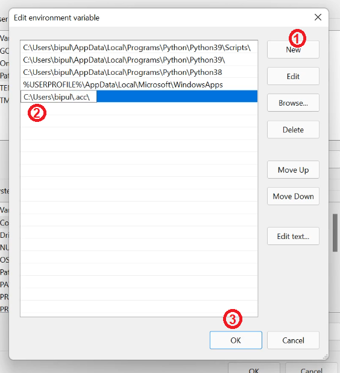

# Auto CPP Compiler
## Version : 1.0.0

Does repetitve compiling task of .cpp file for you :)

### Glimpse of its use

Currenlty Needs:
- Python3
- G++
- Vim/Nano/Gedit or any other text editor


## Section
- [Installation](#installation)
- [Help-Window](#help-window)
- [Open File](#open-file)
- [Show Settings](#show-settings)
- [Change Settings](#change-settings)

## Installation

It has been tested on Ubuntu and Winodws only but is expected to work on other linux based system and mac OS.

Currently the `acc` command only works in Linux and Windows. 

- [Linux](#linux)
- [Windows](#Windows)
- [Mac](#Mac-OS)

## Linux
- Go to downloaded directory in terminal
- And run following command
```
sudo python3 ./install
```
- You can verify if it is installed or not by running following command
```
acc --version
```

## Windows
- Open cmd and go to the download directory
- Run following command
```
python .\install
```
- The above installation command will install the program.
- After running the above command the next step you have to do is create enviornment variable.
### Creating Enviornment Variable
- **Step1**: Open start menu and write following command
```
environment variables
```
- **Step2**: Click the following option

- **Step3**: Click **Environment Variables...** button

- **Step4**: Double click the **Path** field in user section

- **Step5**: Click **New** button
- **Step6**: Put following path
```
C:\Users\bipul\.acc
```
- **Step7**: Click **OK** button in Edit window

- **Step8**: Click **OK** button in Main Window

### Verify installation
- Open new cmd/powershell/terminal/git bash window and type following command
```
acc --version
```


## Mac OS
- Run following command after going to downloaded directory in terminal
```
python3 ./install
```
- Running this will help you later of avoiding python3 everytime on calling the main.py file
- It is currently not tested on this OS.

## Help Window
To get to know different arguments you can add, or any kind of help run:
```
acc --help
```

## Open File
Go to any directory you working and type
```
acc file.cpp
```
- This will open it in the provided editor, and creates a.out output file.
- If you want to give custom output file run
```
acc file.cpp -co custom.out
```

## Show Settings
You can check following things
- Version
```
acc --version
```
- Show Editor
```
acc --se
```
- Show Template
```
acc --st
```

## Change Settings
You can change following things:
- Text editor
```
acc --ce <editor_name>
```
Example:
```
acc --ce vim
```
- Default Template
```
acc --ct
```
- Make sure to save file before closing it.

## Contributions
Feel free to make any contributions to this project :)
